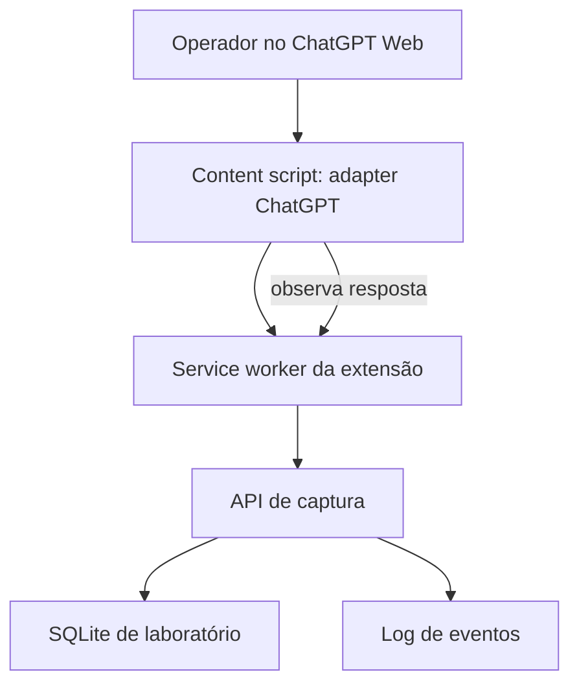

# POC v0.1 — Extensão e backend de captura de interações de IA

**Castelo Branco Contabilidade Avançada · 23/09/2026 · Especificação para testes iniciais**

## 1. Objetivo e recorte

Construir uma extensão Chrome Manifest V3 de laboratório e uma API interna mínima para demonstrar a captura de interações no **ChatGPT Web**, com contas atualmente usadas pela empresa. A POC registra o contexto observável (`conta`, `projeto`, `conversa`), um identificador da instalação, o prompt e, em segundo momento, a resposta visível. O resultado é uma trilha experimental de eventos, **não um backup completo ou um mecanismo de compliance garantido**.

Usar ambiente de testes, conta/projetos de laboratório e textos fictícios; não enviar dados de clientes nesta fase. Não requer ChatGPT Enterprise, Compliance API, chaves da API OpenAI ou conta individual de IA por colaborador.

**Fora da v0.1:** Gemini/Claude, arquivos binários, histórico antigo, reconstrução de projetos na plataforma, SSO, dashboard, regras de DLP em produção, bloqueio garantido de todos os modos de envio, alta disponibilidade e operação em celular/desktop. Registrar anexos visíveis apenas como metadados e com `capture_status=metadata_only`, se viável.

## 2. Resultado esperado

Ao final de um teste, deve ser possível consultar no backend um registro com `interaction_id`, horário, `device_installation_id`, conta informada pelo operador, projeto/conversa observados ou explicitamente `unknown`, prompt, resposta observada ou estado `incomplete`, URL, versão do adapter e eventos de erro. A conta e o projeto não constituem prova de autoria; na POC a conta é **declarada** e o projeto é **observado na interface**. Nunca transformar um valor ausente em identidade presumida.

## 3. Componentes e fluxo



1. A extensão, instalada somente em `https://chatgpt.com/*`, observa a interface da página. Ela gera um `device_installation_id` aleatório em `chrome.storage.local` na primeira instalação e guarda a versão do adapter. O ID identifica a **instalação da extensão**, não atesta identidade da máquina física.
2. Ao detectar uma tentativa de envio, lê o texto e os campos observáveis, gera `client_event_id` (UUID) e envia `POST /v1/interactions`. Nesta primeira etapa, usar modo **observação**: não impedir nem reproduzir o envio para a plataforma. Isso evita afirmar bloqueio antes de comprovar cobertura de clique, Enter, edição e outras rotas.
3. A API valida, atribui `interaction_id`, registra o evento, o horário do servidor e o endereço de origem visto pelo servidor. O IP pode ser de proxy/VPN; confiar em cabeçalhos de proxy somente se a infraestrutura for configurada para isso.
4. A extensão acompanha a resposta renderizada, aguarda um sinal de conclusão observável e período curto de estabilização, e envia `POST /v1/interactions/{id}/response`. Se houver interrupção, troca de conversa ou timeout, registra `incomplete` com o texto parcial disponível.
5. Se a API não estiver acessível, marcar o evento como `delivery_failed` no console/painel de diagnóstico; fila local persistente e política de bloqueio ficam para a etapa seguinte. Não afirmar captura completa quando o evento não foi persistido.

O `service worker` organiza comunicação e transporte; ele não lê o DOM. O `content script` lê o DOM e sinaliza eventos. A separação importa porque o service worker MV3 pode ser suspenso entre eventos.

## 4. Estrutura sugerida do protótipo

```text
poc/
  extension/
    manifest.json
    src/content/chatgpt-adapter.js
    src/content/observer.js
    src/background/service-worker.js
    src/shared/schema.js
    src/popup/diagnostics.html
  backend/
    app/main.py
    app/models.py
    app/db.py
    requirements.txt
    README.md
```

Sugestão de implementação: JavaScript sem framework para a extensão; Python/FastAPI + SQLite para o backend local. A extensão pede apenas permissões necessárias (`storage`, acesso a `chatgpt.com` e ao endereço explícito da API de laboratório). Não armazenar credenciais do ChatGPT. Em teste entre máquinas, usar HTTPS e autenticação de laboratório; `localhost` só serve se o backend estiver na mesma máquina.

## 5. Contrato mínimo da API

### `GET /health`

Retorna `{ "status": "ok", "schema_version": "0.1" }`.

### `POST /v1/interactions`

```json
{
  "schema_version": "0.1",
  "client_event_id": "uuid-do-evento",
  "platform": "chatgpt_web",
  "device_installation_id": "uuid-da-instalacao",
  "account_label": "fiscal@exemplo.com",
  "project": { "name": "Pessoa A", "capture_status": "observed" },
  "conversation": { "url": "https://chatgpt.com/c/...", "capture_status": "observed" },
  "prompt": { "text": "Texto ficticio de teste", "capture_status": "observed" },
  "attachments": [],
  "adapter_version": "0.1.0",
  "observed_at": "2026-09-23T17:00:00Z"
}
```

Resposta `201`: `{ "interaction_id": "uuid-servidor", "status": "request_captured", "received_at": "..." }`. Reenvio do mesmo `client_event_id` deve devolver o mesmo `interaction_id` para evitar duplicidade. O servidor valida tamanhos, tipos, origem e campos obrigatórios. Usar `unknown`/`unavailable` e justificativa para contexto não observado, nunca inventar IDs da plataforma.

### `POST /v1/interactions/{interaction_id}/response`

```json
{
  "client_event_id": "uuid-da-resposta",
  "text": "Resposta visivel de teste",
  "capture_status": "complete",
  "observed_at": "2026-09-23T17:00:15Z"
}
```

`capture_status` aceita `complete` ou `incomplete`; `complete` significa apenas **captura visual aparentemente concluída**, não garantia de conteúdo integral do fornecedor. Receber múltiplos eventos da mesma resposta de forma idempotente, mantendo versão e timestamp; não concatenar snapshots repetidos. Em caso de `interaction_id` inexistente, retornar `404`.

### `GET /v1/interactions/{interaction_id}`

Consulta de diagnóstico restrita a operador autorizado no laboratório; retorna campos persistidos, estados e horários. Não expor endpoint publicamente. Não registrar prompt/resposta em logs de aplicação por padrão.

## 6. Modelo inicial de dados

| Campo ou tabela | Finalidade |
|---|---|
| `interactions` | IDs, conta declarada, projeto/conversa observados, prompt, URL, instalação, status, timestamps e versão do adapter. |
| `responses` | Texto observado, estado de captura, versão e timestamps, ligado a `interaction_id`. |
| `capture_events` | Tipo, resultado, erro e horário, sem duplicar conteúdo sensível nos logs. |
| `client_event_id` único | Deduplicação de tentativas de entrega. |

Estados sugeridos: `request_captured`, `response_observing`, `complete`, `incomplete`, `capture_failed`. Diferenciar falha de observação, falha de entrega e ausência de resposta. O IP de origem é metadado opcional de auditoria, não identificador de colaborador.

## 7. Etapas de desenvolvimento e testes de aceite

| Etapa | Teste | Aceite objetivo | Falha observável |
|---|---|---|---|
| 1 | Instalar e abrir ChatGPT Web | Extensão ativa só no domínio permitido; mostra versão/ID no diagnóstico. | Não ativa, ativa em outro site ou perde ID ao reiniciar. |
| 2 | Abrir dois projetos e uma conversa em cada | Captura os nomes e URLs visíveis corretos ou `unknown` com motivo; não atribui projeto anterior à conversa atual. | Atribuição incorreta ou valor presumido. |
| 3 | Enviar 10 prompts fictícios por clique e Enter | Cada envio observado cria exatamente um evento persistido com texto fiel e horário. Registrar cobertura separada por modo. | Evento ausente, duplicado ou texto divergente. |
| 4 | Reiniciar navegador e repetir | Mesmo ID de instalação, eventos novos com IDs únicos. | ID muda sem reinstalação ou colisão. |
| 5 | Gerar 10 respostas curtas e 5 longas | Associação correta com prompt; texto final comparado manualmente com o visível; estados `complete`/`incomplete` honestos. | Resposta ligada à conversa errada ou `complete` com texto truncado. |
| 6 | Trocar chat/projeto durante streaming e interromper resposta | Evento anterior permanece associado à conversa de origem e fica `incomplete` quando necessário. | Vazamento entre conversas ou completude falsa. |
| 7 | Derrubar API e repetir envio | Extensão mostra falha de entrega; não declara evento salvo. | Perda silenciosa ou estado `complete` sem confirmação. |
| 8 | Reenviar evento já aceito | API mantém um único registro para o `client_event_id`. | Duplicação. |
| 9 | Testar anexo fictício pequeno | Metadados visíveis são registrados como `metadata_only` ou `unavailable`; arquivo não é apresentado como preservado. | Declaração indevida de backup do arquivo. |

Guardar uma planilha simples de evidências de teste (versão do Chrome, data, rota de envio, projeto, ID, esperado, obtido, print sem dados reais). Se as etapas 2, 3 e 5 falharem de maneira recorrente, interromper a expansão e rever a viabilidade do adapter.

## 8. Segunda iteração: avaliação anterior ao envio

Somente após medir as rotas de envio, testar uma **gating POC** em projeto separado: impedir a ação de interface, consultar `POST /v1/evaluate` com timeout, mostrar `allow`/`block` e liberar o envio de maneira controlada. Validar clique, Enter, atalhos, envio com anexo, reenvio e alterações no DOM. Se qualquer rota escapar ou a liberação causar envio duplo, registrar a falha e não anunciar prevenção confiável. Uma extensão dependente da interface não deve ser apresentada como barreira corporativa universal; exigir políticas adicionais do navegador/dispositivo para cobertura mais ampla. Definir fail-open/fail-closed somente depois dos testes e da avaliação de risco.

## 9. Limites, segurança e decisões

- A interface do ChatGPT muda; seletores e sinais de conclusão requerem manutenção. O navegador pode não mostrar todos os identificadores, anexos ou partes do estado da plataforma. O texto renderizado não preserva memória interna, contexto oculto nem histórico anterior à instalação.
- Instalação local não cobre outros navegadores, modo não gerenciado, dispositivos móveis ou aplicativos desktop. Conta compartilhada + nome do projeto não autentica colaborador. Um login corporativo na extensão é decisão posterior.
- Isolar o backend de laboratório, controlar acesso à consulta, usar apenas amostras sintéticas, fixar retenção curta (proposta: 7 dias) e apagar dados após o experimento. Não guardar tokens de sessão, cookies nem segredos da página.
- Antes de piloto com dados reais: definir base e aviso de tratamento de dados, acesso por função, criptografia, retenção, resposta a incidentes, registro de mudanças, autenticação da extensão, infraestrutura de backup e critérios de recovery.
- Decisões após POC: viabilidade da identificação de projeto; cobertura real das rotas de envio; precisão da captura de respostas e anexos; autenticação individual; fila offline; banco/armazenamento definitivos; política de bloqueio; extensão gerenciada e suporte a outras plataformas.

## 10. Referências técnicas

- Chrome Extensions, [content scripts e mundos de execução](https://developer.chrome.com/docs/extensions/develop/concepts/content-scripts): acesso ao DOM com isolamento padrão.
- Chrome Extensions, [ciclo de vida do service worker](https://developer.chrome.com/docs/extensions/develop/concepts/service-workers/lifecycle): processo em segundo plano pode ser suspenso.
- Chrome Extensions, [Declarative Net Request](https://developer.chrome.com/docs/extensions/reference/api/declarativeNetRequest): regras de rede não equivalem a inspeção confiável do corpo de cada prompt.

**Próxima entrega após este documento:** código mínimo executável da extensão, API local, instruções de instalação e roteiro preenchido com resultados reais da POC.
