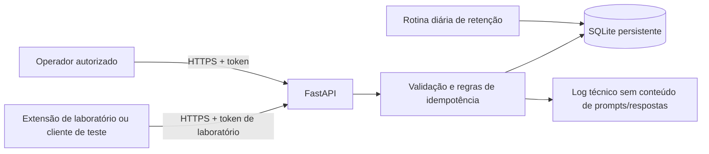

# Plano de implantação — backend da POC de Governança de IA

**Versão:** 0.1  
**Data:** 23/09/2026  
**Base:** `POC_EXTENSAO_BACKEND_GOVERNANCA_IA_v0.1.md`

> Plano inicial, preservado como referência histórica. O backend implementado já usa esquema 0.2 e vínculo assinado por instalação; consulte o [estado atual](ESTADO_ATUAL_2026-10-01.md) e o [guia do backend](../backend/README.md) para operação.

## 1. Objetivo

Implantar um backend interno de laboratório que receba e persista eventos observados pela futura extensão Chrome, permitindo consultar interações fictícias e diagnosticar falhas de captura e entrega. A implantação comprova o fluxo técnico da POC; não oferece backup completo, identidade comprovada, prevenção de envio ou garantia de compliance.

O backend deve permanecer isolado e ser usado somente com conta/projetos de laboratório e conteúdo sintético. A versão 0.1 não deve receber dados de clientes nem ser publicada como serviço aberto à internet.

## 2. Escopo da versão

Incluído:

- API HTTP versionada em FastAPI/Python.
- Persistência local em SQLite, com esquema versionado e migrações controladas.
- Registro idempotente de solicitações e respostas observadas.
- Consulta de saúde e consulta diagnóstica autenticada.
- Eventos técnicos de captura sem cópia de prompts ou respostas nos logs operacionais.
- Execução local para desenvolvimento e implantação de laboratório em uma máquina/VM interna.
- Procedimentos de configuração, inicialização, inspeção, retenção e encerramento.

Fora do escopo: endpoint de avaliação/bloqueio (`/v1/evaluate`), fila offline garantida, SSO, dashboard, múltiplas plataformas de IA, anexos binários, alta disponibilidade, escalabilidade horizontal, backups de produção e tratamento de dados reais.

## 3. Premissas e decisões da POC

| Tema | Decisão para v0.1 |
|---|---|
| Consumidor | Extensão Chrome de laboratório em `chatgpt.com`; até sua entrega, chamadas manuais/sintéticas para validar a API. |
| Aplicação | Python com FastAPI e validação de payloads com Pydantic. |
| Banco | SQLite em volume/disco local persistente, adequado a um único processo de laboratório. |
| Ambiente | `local` na máquina do desenvolvedor; `lab` em máquina/VM interna com HTTPS e acesso restrito. |
| Autenticação | Segredo de laboratório via cabeçalho `Authorization: Bearer ...`, distinto por ambiente; apenas operador autorizado pode consultar registros. |
| CORS | Desabilitado por padrão ou permitido apenas para a origem da extensão de teste explicitamente configurada. |
| Retenção | Sete dias como valor inicial configurável; executar limpeza diária e verificar que dados vencidos foram removidos. |
| Identidade | `device_installation_id` representa a instalação; `account_label` é declarada pelo operador. Nenhum dos campos autentica uma pessoa. |
| Falha de envio | Resposta HTTP de erro explícita; cliente não considera evento persistido sem confirmação da API. Não há fila offline nesta etapa. |
| Proxy/IP | Guardar endereço de origem observado somente se necessário para diagnóstico. Não confiar em `X-Forwarded-For` sem proxy conhecido e configurado. |

## 4. Arquitetura de implantação



O processo da API deve ser o único escritor do arquivo SQLite. A primeira implantação de laboratório deve usar um único worker da aplicação; não compartilhar o arquivo por diretório de rede nem iniciar múltiplas réplicas. Se crescer a concorrência ou houver necessidade de alta disponibilidade, reavaliar o banco antes de ampliar o serviço.

### Ambientes

1. **Desenvolvimento local:** API ligada a `127.0.0.1`; banco e segredo em diretório/configuração local ignorados pelo Git. Acesso apenas da própria máquina.
2. **Laboratório interno:** VM ou host dedicado, processo sem privilégios administrativos, diretório persistente com acesso restrito e proxy TLS interno ou certificado configurado. Firewall permite somente as estações de teste e o operador. Não expor a porta da aplicação diretamente à internet.

O endereço do backend e o token de teste são configurações da extensão/cliente por ambiente. Nunca embutir credenciais pessoais, cookies ou tokens de sessão do ChatGPT.

## 5. Estrutura prevista do backend

```text
backend/
  app/
    main.py                 # criação da aplicação e rotas
    api/                     # endpoints e dependências de autenticação
    schemas.py               # modelos de entrada e saída
    services/                # idempotência, estados e retenção
    db.py                    # conexão e transações SQLite
    models.py                # tabelas/índices
    settings.py              # configuração validada por ambiente
  migrations/                # evolução do esquema
  tests/                     # testes automatizados da API e persistência
  requirements.txt           # dependências com versões fixadas
  .env.example               # nomes de variáveis, sem segredos
  Dockerfile                 # opcional para empacotamento reproduzível
  README.md                  # instalação, execução e diagnóstico
```

É aceitável ajustar essa organização durante a implementação, preservando a separação entre camada HTTP, validação, persistência e configuração. O banco, arquivos `.env` e dados de teste não devem ser commitados.

## 6. Contrato e comportamento da API

### `GET /health`

Retorna estado simples, por exemplo `{"status":"ok","schema_version":"0.1"}`. Não revela caminho do banco, token, variáveis de ambiente ou informações internas. Pode ser usado pelo monitoramento de disponibilidade; não substitui autenticação dos endpoints de dados.

### `POST /v1/interactions`

Valida `schema_version`, `client_event_id` (UUID), plataforma, instalação, rótulo de conta, projeto, conversa, prompt, anexos como metadados, versão do adapter e horário observado. Campos não observáveis devem ter estado explícito (`unknown`/`unavailable`) e motivo quando aplicável. O servidor atribui UUID `interaction_id` e `received_at`.

- Primeira aceitação: `201` com `interaction_id`, `request_captured` e `received_at`.
- Reenvio do mesmo `client_event_id` com o mesmo conteúdo: devolver o mesmo `interaction_id` e não inserir duplicata (resposta pode ser `200` com indicação de repetição).
- Mesmo `client_event_id` com conteúdo diferente: rejeitar como conflito (`409`) e registrar evento técnico sem incluir o conteúdo.
- Payload inválido ou acima dos limites: `422` ou `413`, com mensagem sem ecoar texto sensível.
- Limites máximos para prompt, resposta, URL e quantidade/tamanho de metadados devem ser configuráveis e documentados antes de integrar a extensão.

### `POST /v1/interactions/{interaction_id}/response`

Recebe `client_event_id`, texto observado, `capture_status` (`complete`/`incomplete`), horário observado e versão/snapshot, se adotada. Um evento duplicado não deve concatenar conteúdo. A atualização deve ser transacional: guardar uma versão identificável e timestamp; definir e documentar como tratar snapshots repetidos ou tardios. ID inexistente retorna `404`; conflito de idempotência retorna `409`.

`complete` significa que a interface pareceu terminar e estabilizar; não atesta que o fornecedor mostrou todo o conteúdo gerado. Interrupção, timeout ou troca de conversa deve resultar em `incomplete` quando o cliente enviar texto parcial.

### `GET /v1/interactions/{interaction_id}`

Retorna o registro persistido, resposta(s), estado, horários e eventos técnicos relacionados. Requer token de operador de laboratório. Respostas não devem incluir segredos internos, e a consulta não pode ficar aberta anonimamente.

### Esquema lógico inicial

| Tabela | Conteúdo principal e restrições |
|---|---|
| `interactions` | `interaction_id` PK, `client_event_id` único, instalação, conta declarada, plataforma, campos observados, prompt, URL, estado e timestamps. |
| `responses` | ID do evento de resposta único, FK para interação, texto observado, `capture_status`, versão/snapshot e timestamps. Índice por interação. |
| `capture_events` | tipo, resultado/código, mensagem técnica sanitizada e timestamp; sem duplicar prompts/respostas. |
| `schema_migrations` | versões aplicadas e horário para detectar/criar atualizações de esquema de forma controlada. |

Usar transações e chaves estrangeiras. Índices devem cobrir `client_event_id`, `interaction_id` e datas usadas para retenção. Guardar horários em UTC no banco e ISO 8601 nas respostas da API. Campos JSON devem ter forma validada antes de persistir.

## 7. Segurança e privacidade no laboratório

- Usar somente dados fictícios e contas/projetos de teste; não importar histórico antigo.
- Armazenar token fora do código-fonte, com permissões de leitura restritas ao processo/operador. `.env.example` traz apenas valores fictícios.
- Exigir token em operações de escrita e leitura, salvo health check. Comparar segredo de forma segura e permitir rotação simples por reinicialização.
- Restringir host/origem de rede, TLS no ambiente entre máquinas e firewall ao grupo de teste.
- Não registrar corpo HTTP, prompt, resposta, token, cookies ou cabeçalhos de autorização em logs. Sanitizar exceções e mensagens devolvidas ao cliente.
- Validar tipos, tamanhos, UUIDs, URLs e estados aceitos; usar consultas parametrizadas e transações.
- Desabilitar documentação interativa (`/docs`, `/redoc`) no ambiente `lab`, ou protegê-la junto com a API.
- Guardar o banco em diretório dedicado, não compartilhado, com ACL para o usuário do serviço e operador responsável. Restringir acesso a cópias de segurança temporárias.
- Implementar expurgo diário de registros com mais de sete dias e documentar execução manual. O prazo começa em `received_at`; exceções precisam ser aprovadas antes de ampliar retenção.
- Registrar acesso administrativo e falhas de autenticação de modo agregado, sem conteúdo do evento. Definir responsável pelo laboratório e pelo encerramento/apagamento.

Esses controles cobrem somente a experiência de laboratório. Antes de dados reais, revisar base/aviso de tratamento, acesso por função, autenticação individual, criptografia e retenção, resposta a incidentes, backup/recuperação e aprovação organizacional aplicável.

## 8. Configuração operacional

Variáveis previstas (nomes finais podem ser ajustados na implementação):

| Variável | Exemplo de laboratório | Regra |
|---|---|---|
| `APP_ENV` | `local` ou `lab` | Validar valores permitidos; mudar defaults seguros em `lab`. |
| `APP_HOST` / `APP_PORT` | `127.0.0.1` / `8000` local | Em `lab`, bind na interface privada atrás de TLS/firewall. |
| `DATABASE_PATH` | `./data/lab.sqlite3` | Diretório persistente e protegido; excluído do Git. |
| `LAB_API_TOKEN` | valor aleatório local | Obrigatório para escrita e consulta; jamais registrar ou versionar. |
| `RETENTION_DAYS` | `7` | Inteiro positivo com default de sete dias. |
| `MAX_PROMPT_CHARS` / `MAX_RESPONSE_CHARS` | valor definido durante implementação | Documentar, validar e testar rejeição de excesso. |
| `ALLOWED_ORIGINS` | origem da extensão/cliente de teste | Lista explícita; vazia quando CORS não for necessário. |
| `TRUSTED_PROXY` | vazio por padrão | Configurar somente atrás de proxy controlado. |

O início deve falhar claramente se segredo obrigatório ou caminho de banco estiverem inválidos. Segredos não devem ser impressos no erro.

## 9. Plano de execução e implantação

| Fase | Entrega | Critério de saída |
|---|---|---|
| 0. Preparação | Criar esqueleto, dependências fixadas, configurações e README; definir limites dos campos e operador do laboratório. | Aplicação inicia em local sem credenciais ou dados reais; configuração incompleta falha com mensagem útil. |
| 1. Persistência | Esquema inicial, migração, transações, índices, UUID e timestamps UTC. | Banco vazio é inicializado de modo reproduzível; reinício preserva registros. |
| 2. API de captura | Health, criação idempotente, resposta idempotente e consulta autenticada. | Contratos e códigos de retorno documentados; operações inválidas não alteram dados. |
| 3. Proteções e diagnóstico | Autenticação, limites, logs sanitizados, CORS/host e rotina de retenção. | Requisição sem token não lê dados; logs não contêm payload; expurgo verificável. |
| 4. Validação local | Exercitar API com payloads sintéticos incluindo duplicidade, erro, resposta incompleta e evento tardio. | Critérios técnicos da seção 10 passam; evidências registradas sem dados reais. |
| 5. Implantação lab | Configurar VM/host, segredo, TLS, firewall, disco persistente e processo de serviço. | Acesso somente do grupo de teste; reinício do processo mantém o banco e health volta a responder. |
| 6. Integração extensão | Configurar URL/token de laboratório e percorrer fluxo prompt → resposta → consulta. | Interações aparecem uma vez e estados observados correspondem à interface; falha da API é visível ao cliente. |
| 7. Encerramento | Parar o serviço, exportar apenas evidências sintéticas aprovadas e eliminar o banco de laboratório. | Acesso revogado, token inutilizado e arquivo de dados removido de forma registrada. |

### Procedimento de implantação em laboratório

1. Preparar máquina/VM interna suportada pela equipe, atualizar sistema, criar usuário sem privilégios para executar a API e diretório de dados restrito.
2. Obter código de uma revisão identificável; instalar dependências fixadas em ambiente virtual ou imagem versionada. Não baixar dependências sem revisão do projeto.
3. Configurar variáveis e token de laboratório por mecanismo local protegido. Confirmar que o serviço não está apontando para diretório compartilhado ou banco de produção.
4. Aplicar migrações e iniciar um único processo da API ligado apenas à rede privada. Encerrar acesso externo no firewall e terminar TLS no proxy interno configurado, se clientes estiverem em outras máquinas.
5. Confirmar health, testar autenticação e persistência com uma interação sintética, reiniciar processo e confirmar que a consulta ainda retorna o mesmo `interaction_id`.
6. Configurar extensão/cliente somente com origem e endereço aprovados para o lab. Realizar o roteiro de aceite com nomes e textos fictícios.
7. Verificar logs, limpeza de retenção, permissões do arquivo e alcance de rede; registrar versão do código, configuração sem segredos, operador e horário da implantação.

## 10. Verificação e aceite do backend

Executar a suíte automatizada do backend e registrar versão do Python/dependências e resultado. Não usar prompts reais. Casos mínimos:

| Caso | Resultado esperado |
|---|---|
| `GET /health` | `200`, contrato válido, sem informação interna. |
| Criar interação válida | `201`; ID do servidor e horário presentes; registro consultável. |
| Repetir mesmo evento | Mesmo `interaction_id`, uma interação no banco. |
| Repetir ID com payload divergente | `409`; registro original inalterado. |
| Campos ausentes, enum inválido, UUID/URL inválidos e limites excedidos | Rejeição consistente; nenhum registro parcial. |
| Criar resposta `complete` e `incomplete` | Estado/texto/timestamp associados ao registro correto. |
| Repetir evento de resposta | Nenhuma concatenação nem duplicação. |
| Enviar resposta para interação inexistente | `404`. |
| Consultar sem token/token incorreto | `401`/`403`; nenhum conteúdo revelado. |
| Consultar com token válido | Registro, estados e eventos técnicos apresentados. |
| Reiniciar serviço | Banco permanece íntegro; IDs e registros mantidos. |
| Logar erro de validação e falha interna | Sem prompt, resposta, token ou cookie em logs. |
| Executar retenção com registros vencidos e recentes | Apenas vencidos são eliminados; recentes continuam consultáveis. |
| Reiniciar com banco inacessível ou segredo inválido | Serviço falha de forma explícita e sem vazar segredo. |

Para integração com extensão, reutilizar as etapas 2 a 9 do documento de contexto, separando resultados de backend e cobertura do adapter. O aceite do backend não prova cobertura da extensão.

## 11. Operação e resposta a falhas

- **API indisponível:** cliente exibe `delivery_failed`; operador confere health, processo e conectividade. Não marcar captura como persistida. Reenvio do mesmo `client_event_id` após recuperação é seguro.
- **Banco sem escrita/espaço:** API falha sem confirmar sucesso; registrar erro técnico sanitizado, corrigir disco/permissões e validar integridade antes de continuar.
- **Erro de esquema/migração:** impedir início, preservar o arquivo, revisar versão e procedimento de migração; não apagar banco automaticamente.
- **Token comprometido:** parar acesso externo, revogar/rotacionar token, conferir registros de acesso e revalidar origem. Como os dados são sintéticos, encerrar o experimento se não for possível confirmar contenção.
- **Prompt/resposta em log:** interromper coleta, restringir acesso ao log, apagar a cópia indevida, corrigir sanitização e revisar antes de retomar.
- **Retenção não executada:** bloquear novas rodadas até executar expurgo e confirmar contagem de registros remanescentes.

Não adicionar retentativas cegas com novos IDs. Reenvios devem preservar `client_event_id`. Ainda não há garantia de entrega offline; uma falha antes da confirmação deve ser apresentada como não persistida/indeterminada até consulta por ID.

## 12. Monitoramento e evidências

Na POC, acompanhar disponibilidade de `/health`, quantidade de respostas HTTP por classe, latência, falhas de autenticação, tamanho do banco e última execução de expurgo. Métricas e logs devem conter apenas IDs técnicos/códigos necessários, não conteúdo de prompts ou respostas. Alertas podem ser manuais pelo operador no piloto interno.

Manter um registro de implantação com: revisão do código, versão de Python e dependências, ambiente, operador, data/hora, versão do esquema, resultado do health, testes sintéticos, estado do expurgo e eventual incidente. Prints/evidências devem evitar dados pessoais e segredos.

## 13. Riscos e critérios para evoluir

- SQLite é adequado para teste simples em um host; não assumir que compartilhamento em rede, alta concorrência ou múltiplas réplicas são seguros.
- Captura depende da extensão e da interface web; projeto/conversa podem estar `unknown`, e resposta visível pode estar parcial.
- `account_label`, IP e ID da instalação não identificam com segurança um colaborador.
- Token compartilhado de laboratório não substitui autenticação individual.
- Os dados persistidos são conteúdo sensível mesmo quando fictícios; acesso, retenção e remoção devem ser tratados como parte do teste.

Considerar a POC tecnicamente demonstrada quando o backend passar os casos da seção 10 e a integração conseguir persistir e consultar uma sequência sintética sem duplicidade, com resposta completa/incompleta honesta e diagnóstico explícito em falha de entrega. Antes de piloto real, definir autenticação individual, avaliação de privacidade e segurança, controles de acesso, criptografia, retenção aprovada, backup/recuperação, gestão de segredos e aprovação organizacional. PostgreSQL e operação gerenciada são decisões de uma fase posterior, justificadas por carga e requisitos medidos.

## 14. Próxima entrega de engenharia

Após revisar este plano, a implementação deve produzir o backend executável, sua suíte de testes automatizados, `.env.example`, instruções de execução local, mecanismo de retenção e instruções para implantação no laboratório. Os resultados reais do roteiro devem ser registrados separadamente; este documento não antecipa resultados ainda não executados.
