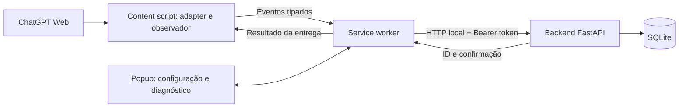

# Plano de implantação — extensão da POC de Governança de IA

**Versão:** 0.1  
**Data:** 23/09/2026  
**Status:** plano inicial preservado como histórico; a versão integrada 0.5.0 foi implementada e aguarda validação ponta a ponta no navegador.  
**Base:** [Especificação da POC](../POC_EXTENSAO_BACKEND_GOVERNANCA_IA_v0.1.md) e [plano do backend](PLANO_IMPLANTACAO_BACKEND_POC_v0.1.md).

Para o fluxo atual de cadastro, atribuição e captura, consulte o [estado atual](ESTADO_ATUAL_2026-10-01.md) e o [guia da extensão integrada](../extension-prompt-block-poc/README.md).

## 1. Objetivo

Construir uma extensão Chrome de laboratório para observar prompts e respostas visíveis no ChatGPT Web e encaminhá-los ao backend da POC. A primeira implantação ocorrerá no mesmo computador do backend, sem VM, usando textos fictícios.

O resultado esperado é uma sequência consultável de interações, com contexto observado, associação entre prompt e resposta, confirmação de persistência e diagnóstico explícito de falhas. A cobertura real será medida no navegador; captura integral, autoria comprovada e prevenção de envio não são garantias desta versão.

## 2. Escopo da versão

Incluído:

- Extensão Chrome Manifest V3, JavaScript sem framework e instalação manual de laboratório.
- Ativação apenas em `https://chatgpt.com/*`.
- Painel de configuração e diagnóstico em português.
- ID persistente da instalação, conta declarada e versão do adapter.
- Captura observacional de tentativas de envio por clique e Enter.
- Observação da resposta renderizada, com conclusão aparente ou estado incompleto.
- Integração autenticada com a API local e indicação de confirmação de entrega.
- Projeto/conversa observados ou ausência explícita com motivo.
- Anexos apenas como metadados visíveis, quando identificáveis.

Fora da v0.1: bloqueio/liberação de prompts, avaliação por IA, DLP, fila offline persistente, recuperação de histórico, arquivos binários, SSO, publicação em loja, distribuição corporativa, Gemini/Claude, aplicativos desktop e dispositivos móveis. Edição, regeneração e rotas alternativas serão avaliadas como limites de cobertura, sem presumir suporte.

## 3. Premissas e decisões da POC

| Tema | Decisão para v0.1 |
|---|---|
| Ambiente inicial | Chrome e backend no mesmo computador; API em `http://127.0.0.1:8000`. |
| Modo de operação | Observação; os eventos da página continuam seu fluxo normal. |
| Instalação | Extensão descompactada, carregada manualmente pelo operador. |
| Interface | Popup com configuração, habilitação da captura e diagnóstico resumido. |
| Identidade | UUID da instalação e conta informada pelo operador; sem atribuição automática de colaborador. |
| Transporte | Service worker chama a API com Bearer token; content script observa a página. |
| Segredo | Token de laboratório informado no popup, mantido em armazenamento de sessão restrito aos contextos confiáveis da extensão. Reiniciar o navegador exige informá-lo novamente. |
| Conteúdo | Prompt e resposta ficam em memória durante o fluxo; não formar arquivo local de conversas. |
| Confirmação | Somente resposta válida da API permite declarar persistência. |
| Evolução de ambiente | Backend em outra máquina exige endereço interno HTTPS e ajuste explícito das permissões da extensão. |

## 4. Arquitetura de implantação



O adapter concentra seletores e sinais específicos da interface. O observador controla a interação ativa por aba/documento e acompanha a resposta. O service worker valida as mensagens, monta destinos fixos da API, adiciona autenticação e devolve o resultado. O popup configura e apresenta o estado sem precisar permanecer aberto.

Chamadas cross-origin devem partir do service worker com permissões de host. O content script não deve encaminhar URLs arbitrárias para o worker acessar. Referência: [requisições de rede em extensões](https://developer.chrome.com/docs/extensions/develop/concepts/network-requests).

O worker pode ser encerrado entre eventos. Configuração e metadados necessários à retomada não devem depender apenas de variáveis globais; suspender o worker não pode trocar a associação entre interações. Referência: [ciclo de vida do service worker](https://developer.chrome.com/docs/extensions/develop/concepts/service-workers/lifecycle).

## 5. Estrutura prevista da extensão

```text
extension/
  manifest.json
  src/
    content/
      chatgpt-adapter.js     # leitura do DOM e sinais da plataforma
      observer.js            # tentativas, navegação e respostas
    background/
      service-worker.js      # mensagens e coordenação
      api-client.js          # autenticação, timeout e contrato HTTP
    shared/
      schema.js              # validação e tipos de mensagens
      storage.js             # configuração e metadados de diagnóstico
    popup/
      diagnostics.html
      diagnostics.js
      diagnostics.css
  tests/
    fixtures/                # DOM sintético, sem dados reais
  README.md
```

Concentrar seletores no adapter e manter recursos executáveis no pacote local. A versão do adapter deve acompanhar mudanças na interpretação da interface, independentemente da versão do esquema da API.

## 6. Contrato e comportamento da captura

### Identificação e contexto

Gerar `device_installation_id` uma única vez por instalação e guardá-lo em `chrome.storage.local`. Uma reinstalação pode produzir outro ID. Guardar conta declarada e configurações locais separadamente do conteúdo observado.

Na tentativa de envio, congelar o contexto de origem: aba/documento, conversa, projeto, horário, texto e UUID do evento. Não usar o projeto anterior como fallback. Contexto desconhecido exige `capture_status=unknown` ou `unavailable` e `reason`, conforme o backend atual.

Uma conversa nova pode ainda não ter URL definitiva. Registrar o que estava visível naquele instante e manter a correlação local se a página receber uma URL depois. O contrato atual não tem endpoint para corrigir retroativamente o contexto; não inventar um identificador para preencher essa lacuna.

### Prompt

Detectar clique e Enter antes que o campo seja limpo, respeitando composição de texto e quebra de linha. Correlacionar sinais do mesmo envio para evitar duplicatas; prompts iguais enviados em momentos diferentes são eventos distintos.

O evento representa uma tentativa observada. Se a plataforma rejeitar o envio depois, a extensão não deve afirmar que o fornecedor recebeu o prompt. Guardar o UUID e o payload original durante a tentativa de entrega.

### Integração com a API existente

| Rota | Uso pela extensão | Resultado esperado |
|---|---|---|
| `GET /health` | Diagnóstico de conectividade e esquema. | `200` com `schema_version=0.1`; não comprova validade do token. |
| `POST /v1/interactions` | Enviar prompt, contexto, instalação e versão. | `201` ou repetição `200`; receber `interaction_id`. |
| `POST /v1/interactions/{id}/response` | Enviar snapshot final ou parcial da resposta. | `201` ou repetição `200`; confirmar persistência da resposta. |
| `GET /v1/interactions/{id}` | Consulta diagnóstica autorizada pelo operador. | Confirmar dados associados ao ID, sem copiar conteúdo para logs. |

Usar UUIDs, horários ISO 8601 com fuso e somente campos aceitos pelo backend. Valores iniciais de limite: prompt com 100.000 caracteres, resposta com 200.000, URL com 4.096 e até 20 anexos. Conferir esses limites contra a configuração efetiva antes da rodada; a API não expõe configuração de limites. Rejeitar excesso com diagnóstico, sem truncamento silencioso.

### Resposta e associação

Observar somente a resposta ligada à tentativa ativa, distinguindo-a de mensagens já renderizadas. Começar a observação enquanto o prompt é entregue à API, mantendo o conteúdo parcial em memória até receber `interaction_id`.

Marcar `complete` somente com sinal observável de término e estabilidade do texto. Estabilidade isolada durante uma pausa do streaming não comprova conclusão. Na dúvida, encerrar como `incomplete`.

Troca de conversa/projeto, interrupção ou timeout deve encerrar a observação anterior com o conteúdo parcial disponível. Fechar aba ou navegador pode impedir a entrega final; registrar essa limitação no aceite. Em associação ambígua, sinalizar falha e evitar ligar a resposta a outro prompt.

Enviar um snapshot terminal por interação nesta versão. O backend atual guarda eventos de resposta separados e atualiza o estado conforme a chegada; não presume ordenação por `observed_at`. Atualizações contínuas e snapshots tardios exigem definir essa política antes de ampliar o fluxo.

### Estados de observação e entrega

| Dimensão | Estados e significado |
|---|---|
| Observação local | `idle`, `request_observed`, `response_observing`, `complete`, `incomplete`, `capture_failed`. |
| Entrega local | `pending`, `confirmed`, `delivery_failed`, `delivery_unknown`. |
| Persistência do backend | Estado devolvido pela API e `interaction_id` confirmado. |

Uma resposta observada como completa pode ter entrega falhada. Timeout após o envio deixa a persistência indeterminada: a API pode ter gravado antes de a conexão cair. Repetir o mesmo evento, se o payload ainda estiver disponível, exige conservar UUID e conteúdo. Sem confirmação, não exibir “salvo”. Não implementar fila offline persistente nesta etapa.

## 7. Segurança e privacidade no laboratório

- Permissão `storage`, correspondência do content script em `https://chatgpt.com/*` e host de API local explicitamente declarado; evitar `<all_urls>`.
- Validar esquema e remetente das mensagens, incluindo aba/documento e origem para eventos de captura. Não expor uma ponte genérica de chamadas HTTP à página.
- Definir o endpoint autorizado no worker e validar a origem configurada; rejeitar redirecionamentos de transporte para evitar encaminhar o segredo a outro destino.
- Restringir armazenamento de configuração aos contextos confiáveis e fornecer ao content script apenas informações necessárias. Manter token em sessão, mascarado no popup, sem sincronização entre dispositivos. O armazenamento da extensão não é um cofre contra acesso local ao perfil.
- Usar `textContent` ao apresentar dados e erros; não interpretar texto capturado como HTML executável.
- Não ler cookies, tokens de sessão do ChatGPT, senhas ou credenciais da página.
- Logs e diagnóstico contêm IDs, códigos, estados e horários, sem prompt, resposta ou token.
- Captura inicia desabilitada; operador configura e habilita o laboratório. Usar somente dados sintéticos.

As áreas `local` e `session` atendem a necessidades diferentes de persistência e acesso; aplicar os controles de acesso disponíveis durante a implementação. Referência: [API de armazenamento da extensão](https://developer.chrome.com/docs/extensions/reference/api/storage).

## 8. Configuração operacional

| Campo | Valor inicial | Regra |
|---|---|---|
| URL da API | `http://127.0.0.1:8000` | Permitir somente o destino local aprovado no primeiro pacote. |
| Token | Informado pelo operador | Necessário para captura; renovar após reiniciar navegador. |
| Conta declarada | Rótulo de laboratório | Exibir como declaração do operador. |
| Captura habilitada | Não | Habilitar após configuração; pausar quando faltar token. |
| ID da instalação | UUID gerado | Persistir entre reinícios; somente leitura no popup. |
| Versão do adapter | `0.1.0` | Enviar com cada interação. |
| Timeout HTTP | 10 segundos, proposta inicial | Mostrar resultado indeterminado quando não houver confirmação. |
| Janela de estabilidade | 2 segundos, proposta inicial | Usar junto ao sinal de término; calibrar nos testes. |
| Timeout da observação | 180 segundos, proposta inicial | Encerrar como incompleta; medir adequação a respostas longas. |
| Diagnóstico recente | Até 100 eventos, proposta inicial | Metadados de sessão, sem conteúdo; não equivale a fila de entrega. |

O popup deve mostrar configuração válida/incompleta, estado da captura, conectividade, última confirmação de entrega e falhas recentes. “API acessível” não significa “token validado” nem “captura funcionando”.

## 9. Plano de execução e implantação

| Fase | Entrega | Critério de saída |
|---|---|---|
| 0. Base | Manifest, worker, popup e configuração. | Instala sem erro e atua apenas no domínio definido. |
| 1. Transporte | Cliente HTTP, validação de mensagens e diagnóstico. | Evento sintético confirmado e consultável na API local. |
| 2. Contexto | ID da instalação, conta declarada, projeto/conversa observados. | Valores corretos ou ausência com motivo; sem herança entre conversas. |
| 3. Prompt | Detecção por clique/Enter e deduplicação local. | Dez envios por rota, sem perda ou duplicação no conjunto medido. |
| 4. Resposta | Observação, correlação e estados terminais. | Respostas ligadas ao prompt correto, com comparação visual e estado honesto. |
| 5. Falhas | Troca de chat, timeout, API desligada, worker suspenso e múltiplas abas. | Falhas explícitas e ausência de mistura entre interações. |
| 6. Aceite | Testes automatizados, roteiro manual e evidências. | Resultados documentados, limitações identificadas e critérios atendidos. |
| 7. Encerramento | Desabilitar captura, limpar sessão e remover instalação de teste quando aplicável. | Coleta encerrada e credenciais de laboratório revogadas. |

### Procedimento de instalação local

1. Preparar e iniciar o backend conforme seu README, ligado a `127.0.0.1`, com token próprio de laboratório.
2. Abrir `chrome://extensions`, habilitar modo de desenvolvedor e carregar a pasta `extension/` como extensão descompactada.
3. Abrir o popup, conferir versão e ID, configurar API, token e conta declarada.
4. Consultar health e conferir o esquema. Habilitar a captura e abrir/recarregar a página de teste do ChatGPT.
5. Enviar um texto fictício e consultar o ID retornado para verificar prompt e resposta.
6. Executar a matriz de aceite e registrar a versão do Chrome e do adapter.
7. Após atualizar a extensão, recarregá-la e recarregar as abas de teste para que usem a mesma versão.

Não há dependência de VM para esse procedimento. Testes em outras máquinas exigem uma etapa posterior de configuração da rede, HTTPS e permissões do host da API.

## 10. Verificação e aceite da extensão

Automatizar validação de mensagens, geração/persistência de IDs, deduplicação, montagem de payloads, tratamento HTTP e associação de respostas usando DOM sintético. Validar a interface real manualmente; fixtures não comprovam compatibilidade com a página atual.

| Caso | Resultado esperado |
|---|---|
| Instalar e abrir site permitido/outro site | Ativação somente em ChatGPT; configuração e diagnóstico acessíveis. |
| Reiniciar navegador | Mesmo ID da instalação; token solicitado novamente e captura pausada até configurar. |
| Abrir dois projetos e conversas distintas | Contexto correto ou `unknown` com motivo; não reutilizar projeto anterior. |
| Dez envios por clique e dez por Enter | Um evento por tentativa observada, texto fiel e ID confirmado. |
| Dois prompts iguais em sequência | Dois eventos distintos. |
| Shift+Enter e composição de texto | Não registrar como envio sem evidência de submissão. |
| Dez respostas curtas e cinco longas | Associação correta e comparação manual do texto; sem completude falsa. |
| Troca de conversa ou interrupção no streaming | Resposta anterior parcial/incompleta quando possível; sem vazamento para nova conversa. |
| Duas abas com envios simultâneos | IDs e respostas isolados por origem. |
| Suspensão do worker e popup fechado | Transporte retoma quando acionado; falhas não desaparecem silenciosamente. |
| API desligada, token inválido e timeout | Mensagem útil; nunca declarar persistência sem confirmação. |
| Reenvio idêntico e conflito `409` | Idempotência preservada; conflito não gera novo UUID automaticamente. |
| Payload rejeitado ou excedente | Diagnóstico `422`/limite, sem truncar ou repetir indefinidamente. |
| Anexo fictício | Apenas metadados ou indisponibilidade explícita; nenhum binário apresentado como salvo. |
| Edição, regeneração e outras rotas | Cobertura medida separadamente; modo não suportado identificado quando detectável. |
| Mudança de DOM/seletores ausentes | Falha de captura explícita, sem inventar contexto ou resposta. |
| Inspeção de armazenamento, logs e mensagens | Sem conteúdo persistente de conversas e sem token disponível ao content script. |

Se contexto, captura de prompts ou associação de respostas falharem recorrentemente, interromper a expansão e revisar a viabilidade do adapter.

## 11. Operação e resposta a falhas

- **API indisponível:** conferir processo local e destino configurado; manter diagnóstico de entrega falhada/indeterminada.
- **401:** solicitar correção do token, pausar novas capturas e retomar explicitamente após configuração.
- **404 ao enviar resposta:** preservar diagnóstico do vínculo inválido; não criar outra interação para acomodar a resposta.
- **409:** registrar conflito de idempotência e investigar reutilização de UUID ou alteração do payload.
- **422:** revisar contrato e limites; não enviar corpo inválido repetidamente.
- **Seletores ausentes ou associação ambígua:** marcar captura falhada/incompleta; revisar adapter antes de nova rodada.
- **Aba fechada ou navegador reiniciado:** aceitar a possibilidade de perda do conteúdo ainda em memória; não anunciar recuperação offline.
- **Troca de configuração durante interação:** congelar destino e contexto para o fluxo em andamento ou encerrá-lo explicitamente; nunca encaminhar uma resposta para outro backend por engano.

O backend atual não possui endpoint dedicado para receber erros do adapter. Nesta versão, essas falhas aparecem no diagnóstico local; o backend registra os eventos que efetivamente recebe. Persistir erros da extensão no servidor será uma extensão explícita do contrato.

## 12. Monitoramento e evidências

Registrar eventos observados, entregas confirmadas, falhas, estados de resposta e latência HTTP. Apresentar contagens como métricas da rodada, sem afirmar cobertura de ações que a extensão não detectou.

Usar uma planilha ou arquivo de evidências com: data, Chrome, versão da extensão/adapter, cenário, rota de envio, projeto fictício, `client_event_id`, `interaction_id`, esperado, obtido e evidência visual sanitizada. Comparar contagens com a API para detectar perdas e duplicações.

Os oito testes básicos anteriormente executados no backend não constituem aceite da extensão. Resultados desta integração serão registrados após a implementação e execução no navegador.

## 13. Riscos e critérios para evoluir

Dependência do DOM, mudanças de navegação e sinais ambíguos de término podem afetar a captura. A extensão não recupera contexto oculto, memória interna ou mensagens anteriores à instalação. Conta compartilhada, projeto observado e ID da instalação não comprovam autoria.

Considerar demonstrada a integração local quando os cenários centrais de prompt, contexto, resposta, idempotência e falha de API tiverem evidências satisfatórias, incluindo isolamento entre abas e ausência de completude falsa.

Depois do aceite, decidir sobre fila offline, autenticação individual, ordenação de snapshots no backend, persistência de erros, distribuição gerenciada e outras plataformas. A avaliação anterior ao envio permanece uma POC posterior com cobertura própria de rotas e critérios de bloqueio.

## 14. Próxima entrega de engenharia

A pasta `extension/` foi criada e o primeiro fluxo sintético de prompt e resposta foi confirmado localmente em 24/09/2026. A versão 0.1.4 do adapter precisa agora ser medida nas rotas de envio, contexto, respostas e falhas previstas acima.

A execução, as evidências e os critérios de decisão dessa próxima etapa estão no [roteiro de validação local](ROTEIRO_VALIDACAO_LOCAL_POC_v0.1.md). O resultado de uma interação não encerra o aceite da extensão.
